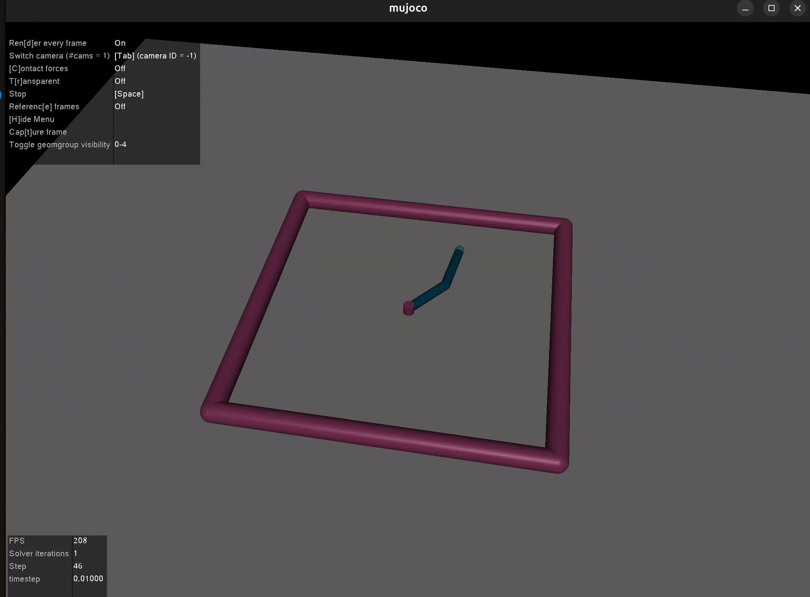

# 🤖 MuJoCo-RL-Continuous-Control
> 基于 MuJoCo 物理引擎的连续动作空间机器人控制基线算法实现 (Stable-Baselines3 / PPO)

-0052CC)

## 📖 项目简介
本项目聚焦于机器人底层控制中的**连续动作空间 (Continuous Action Space)** 规划问题。
利用强化学习 (PPO 算法) 替代传统基于模型的控制方法（如 MPC/PID），在 MuJoCo 高精度刚体动力学仿真器中，成功实现了欠驱动单足机器人 (Hopper) 的动态平衡行走，以及多自由度机械臂 (Reacher) 的末端高精度寻迹以及多个机构的ppo模型训练

本项目证明了数据驱动方法在处理高维、非线性动力学系统时的强大潜力。

## 🎬 核心任务演示 (Demos)

| 🦿 单足机器人动态平衡 (Hopper-v4) | 🦾 机械臂末端追踪 (Reacher-v4) |
| :---: | :---: |
|  |  |
| **难点**: 强欠驱动系统、周期性动态平衡 | **难点**: 多关节协同、类 IK (逆运动学) 求解 |

## 🛠️ 核心工程突破

在本项目开发中，重点解决了以下强化学习落地工程问题：

### 1. 观测空间归一化 (Observation Normalization)
- **问题**：在 MuJoCo 中，不同传感器传回的物理量（如关节位置 $q$ 与接触力 $F$）存在巨大的量级差异，导致神经网络梯度更新极度不稳定，出现“原地抽搐”现象。
- **解决**：引入 `VecNormalize` 包装器，在训练时实时动态统计状态均值与方差，将高维异构的物理观测张量强制拉回到 $\mathcal{N}(0, 1)$ 标准正态分布，大幅提升了策略收敛的稳定性和速度。

### 2. 连续力矩控制 (Continuous Torque Control)
- 与离散动作控制不同，网络输出被映射为底层电机的连续力矩指令 $\tau \in [-1, 1]$。
- 在机械臂(Reacher)任务中，通过平衡“距离惩罚项”与“控制能耗惩罚项 ($L_2$ 正则化)”，有效消除了末端执行器在目标点附近的稳态抖动 (Steady-state Jitter)，实现了平滑的伺服控制。

### 3. 欠驱动系统自稳定步态 (Underactuated Locomotion)
- Hopper 是典型的欠驱动系统（无固定支撑基座）。通过数十万次环境交互，PPO 策略网络自主涌现（Emergence）出了**利用重力势能与躯干前倾角换取前向动能**的周期性跳跃步态机制，而非陷入局部最优的“原地死站”。
- 
- 快速复现 (How to Run)
环境依赖:
Bash
pip install torch numpy gymnasium[mujoco] stable-baselines3

将ppo_cartpole.py第五行"ppo_Hopper-4v"改为"你想运行的结构(如ppo_cartpole)"保存后
Bash
python3 Gym-RL-Baselines/ppo_cartpole.py

